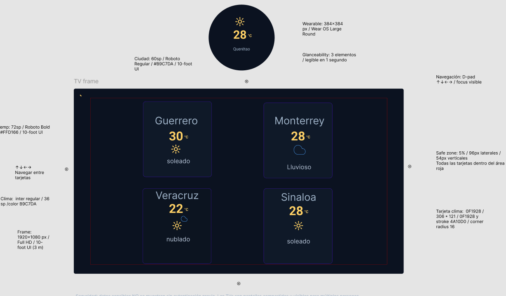

# P1.3 — Adaptación de UI para wearable y pantalla inteligente

## Enlaces
- Archivo Figma (página "Wearable y TV"):
  `https://www.figma.com/design/vFOw9BZK8KrrH8ROtJnlvX/P1.2_App_Clima_Marco_Antonio_G%C3%B3mez_Olvera?node-id=3333-2&t=mMJQrZ7fS3JV74fg-1`
- Evidencias: carpeta `images/`.

## Evidencias

## Entregables incluidos
- Watchface circular 384×384 px (3 elementos visibles).
- Dashboard TV 1920×1080 px con safe zone del 5% y 4 tarjetas de ciudades.
- Navegación D-pad anotada.
- Documento de decisiones de diseño (`Decisiones.md`).
- Nota de seguridad en TV: datos sensibles no se muestran sin autenticación previa.
