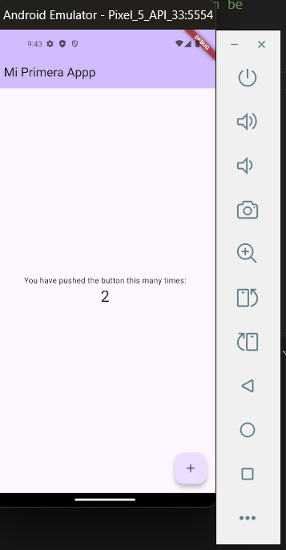
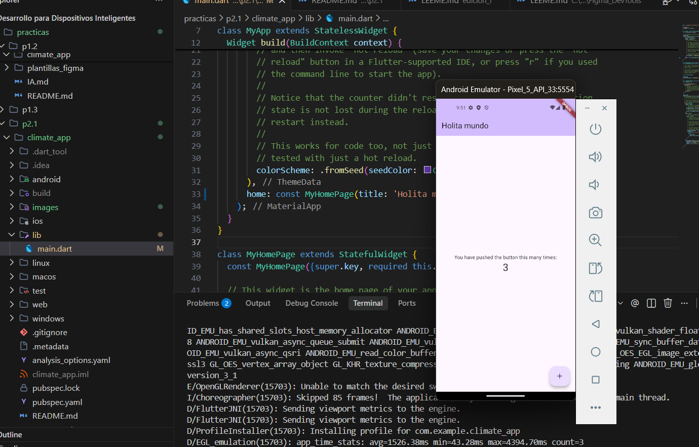

# Climate App

App Flutter para mostrar clima en telefono y wearable.

## Setup

1. `flutter pub get`
2. `flutter run`

## Resultado

La aplicacion muestra una pantalla con AppBar, un contador y un boton flotante con tema Material Design.
El hot reload funciona presionando `r` en la terminal despues de guardar cambios en `lib/main.dart`.

## Nota sobre el hot reload automatico (Ctrl+S)

En esta practica no se logro activar el hot reload automatico al guardar archivos con `Ctrl+S`. Esta funcionalidad no forma parte del SDK de Flutter, sino que depende exclusivamente de la extension oficial de Flutter para el editor de codigo, la cual escucha el evento `onDidSaveTextDocument` y dispara internamente el comando de hot reload sobre la sesion activa.

Para que esa cadena funcione se requiere:

1. Que el proyecto haya sido iniciado desde el propio editor mediante la opcion **Run and Debug** (F5), no desde una terminal externa.
2. Que la extension detecte el `pubspec.yaml` y registre el dispositivo activo en el `Debug Console`.

En el entorno utilizado, la sesion de `flutter run` se inicia desde la terminal integrada, por lo que la extension no la administra y el evento de guardado no se conecta con la VM de Flutter. Como alternativa equivalente se utilizo el hot reload manual presionando la tecla `r` en la terminal donde corre el proceso, el cual produce el mismo resultado funcional (recarga de codigo preservando el estado de la aplicacion).

## Evidencias

### App en ejecucion

### Hot reload aplicado

