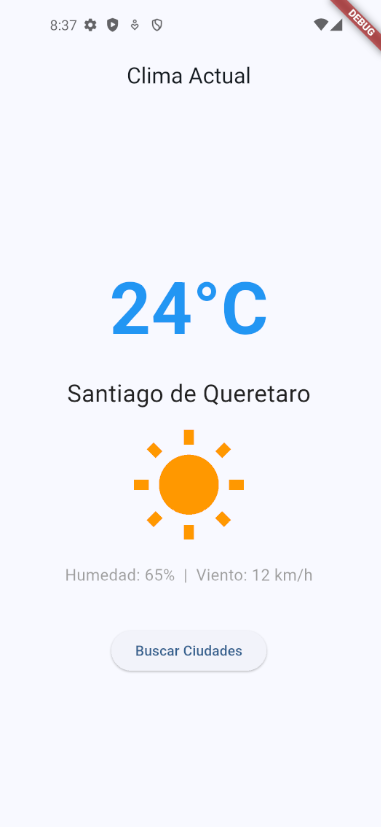
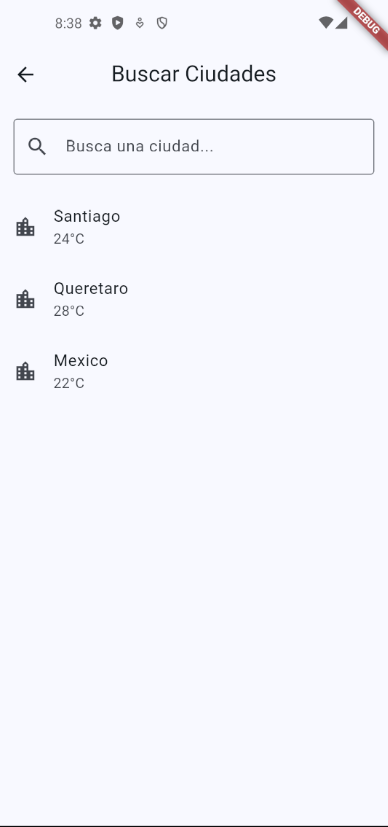
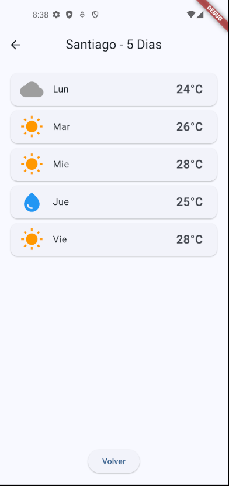

# Climate App - UI Companion

App Flutter con 3 pantallas navegables para consulta de clima.

## Estructura

- `lib/screens/home_screen.dart` - Dashboard principal
- `lib/screens/search_screen.dart` - Busqueda de ciudades con filtrado
- `lib/screens/detail_screen.dart` - Pronostico de 5 dias
- `lib/widgets/weather_icon.dart` - Icono de clima reutilizable

## Setup

1. `flutter pub get`
2. `flutter run`

## Navegacion

- Dashboard -> Buscar Ciudades -> Detalle de ciudad -> Volver
- Implementado con `Navigator.push` y `Navigator.pop`

## Responsive

El dashboard adapta su disposicion usando `MediaQuery`:
- Portrait: elementos en columna vertical
- Landscape: elementos en fila horizontal

## Evidencias

### Pantalla 1: Dashboard

### Pantalla 2: Busqueda

### Pantalla 3: Detalle

