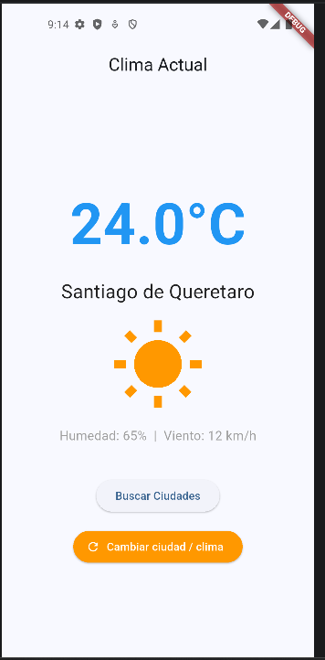
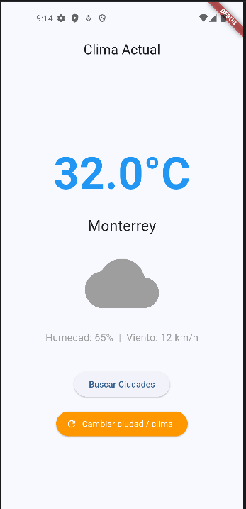

# Práctica P2.3 – App de Clima (Flutter)

Esta práctica evoluciona la P2.2 incorporando manejo de estado con `provider`, separación de lógica pura y pruebas de UI reactivas.

## Cómo ejecutar

```bash
cd practicas/p2.3/climate_app
flutter pub get
flutter emulators --launch <AVD_ID>   #abrir mejor el emulador de android studio :)
flutter run -d <device-id>
```

## Entregables incluidos

- Código fuente completo en `climate_app/` (Android, iOS, web, desktop).
- `lib/models/weather.dart`  – modelo con validaciones.
- `lib/providers/weather_provider.dart` – gestor de estado (`ChangeNotifier`).
- `lib/utils/weather_utils.dart` – funciones puras `formatTemperature` y `getWeatherIcon`.
- Botón *Cambiar ciudad / clima* que demuestra la actualización reactiva sin recargar la app.

## Capturas de la app





