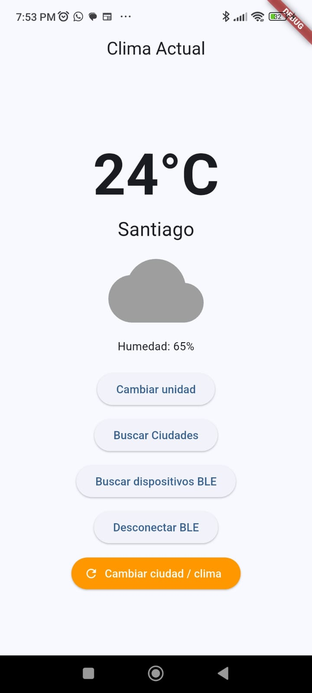
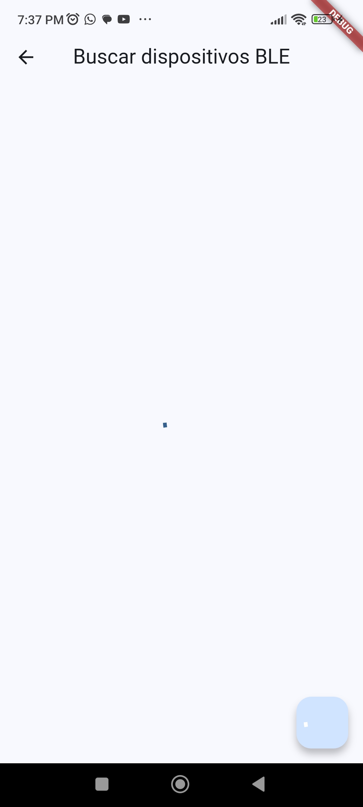
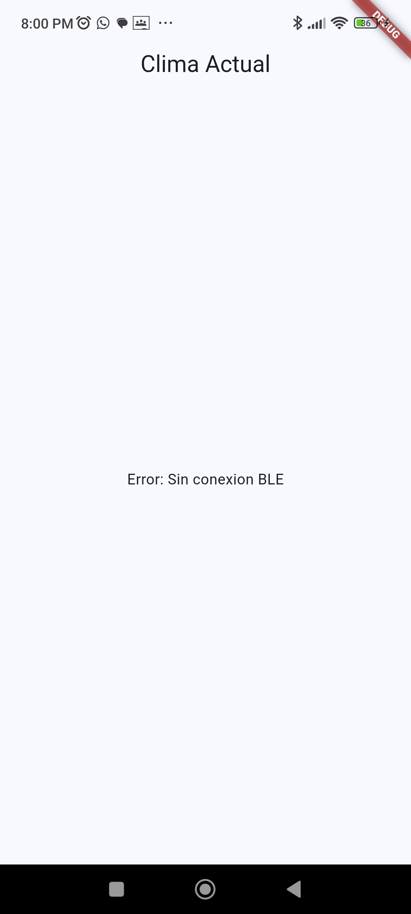
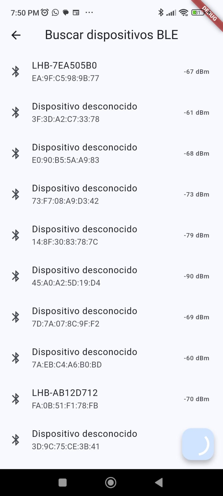
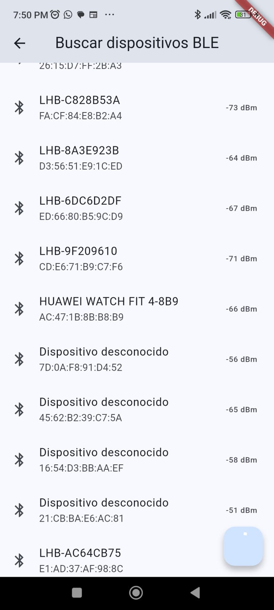
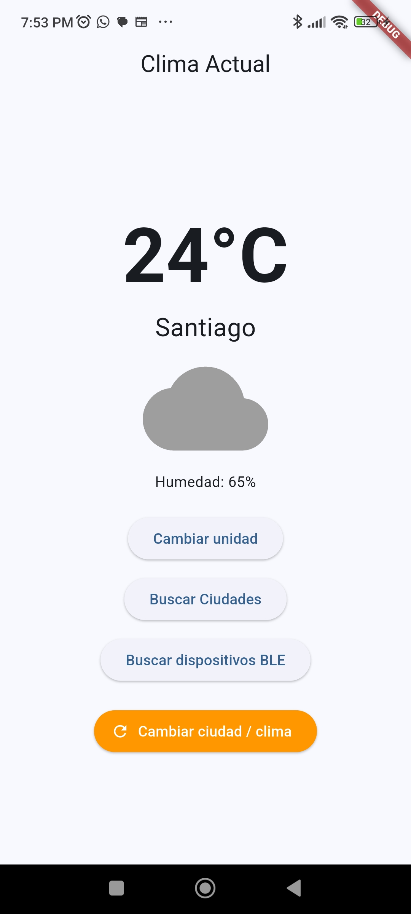
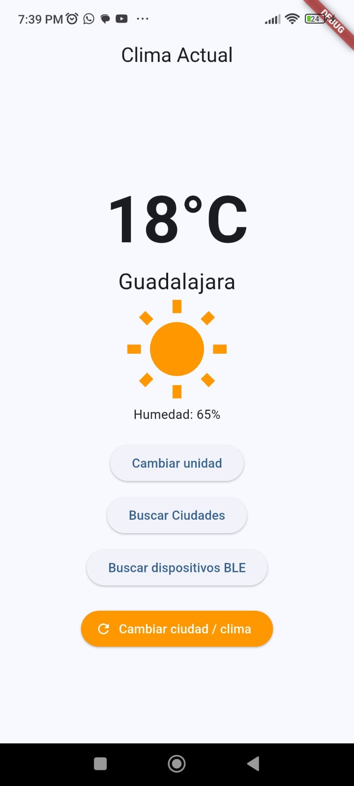

# Práctica P2.4 – Integración Bluetooth Low Energy (BLE)

Implementación de escaneo, conexión y lectura de datos de dispositivos BLE (wearables compatibles).

## Cómo ejecutar

```bash
cd practicas/p2.4/climate_app
flutter pub get
flutter run -d <device-id>
```

## Entregables incluidos

- `lib/services/ble_service.dart` – clase BLEService con métodos scan, connect, readCharacteristic.
- `lib/providers/weather_provider.dart` – métodos de escaneo, conexión y lectura BLE integrados.
- `lib/screens/ble_screen.dart` – UI de búsqueda de dispositivos BLE.
- Permisos BLE en `AndroidManifest.xml` (BLUETOOTH, BLUETOOTH_SCAN, BLUETOOTH_CONNECT).
- `minSdk = 23` en `android/app/build.gradle.kts`.
- Manejo de desconexión: muestra "Sin conexion BLE" al desconectarse.
- Validación de datos: rango de temperatura (-60 a 60), longitud de strings.
- App ejecutable sin errores.

## Conclusión

En esta práctica aprendí a integrar Bluetooth Low Energy en una app de Flutter usando el paquete flutter_blue_plus. Fue interesante ver cómo se escanean dispositivos cercanos, se establece la conexión y se leen las características GATT para obtener datos como la temperatura. 

También entendí la importancia de validar la información antes de mostrarla en la interfaz, ya que un wearable podría enviar datos incorrectos o incluso maliciosos. Por eso agregué validaciones de rango, tipo de dato y longitud de strings para mantener la app segura.

Por otro lado, el manejo de desconexiones y reintentos de conexión fueron clave para que la app no se quede colgada si el wearable se apaga o se aleja. En general, me pareció una práctica muy útil porque muestra cómo conectar apps móviles con dispositivos del mundo real.

## Tabla comparativa: guía vs entregado

| Requisito guía | Estado |
|---|---|
| flutter_blue_plus en pubspec.yaml | Entregado |
| minSdkVersion >= 21 (23+) | Entregado |
| Permisos BLE en AndroidManifest.xml | Entregado |
| BLEService con scan, connect, readCharacteristic | Entregado |
| scanForDevices() devuelve Stream | Entregado |
| connect(deviceId) conecta al dispositivo | Entregado |
| discoverServices() para leer características | Entregado |
| Busca UUID y lee con read() | Entregado |
| Provider Weather llama BLEService | Entregado |
| Botón "Buscar dispositivos BLE" en UI | Entregado |
| Lista de dispositivos encontrados | Entregado |
| Conexión con estado de carga | Entregado |
| "Sin conexion BLE" al desconectarse | Entregado |
| Intentos de reconexión automáticos | Entregado |
| Validación de datos: rango (-60 a 60), city < 50 | Entregado |
| No usar setCharacteristicNotification sin validar UUID | Entregado |
| Bluetooth apagado: mensaje informativo | Entregado |
| initState sin crash de build | Entregado |
| Overflow de pantalla corregido | Entregado |
| Captura del emulador/dispositivo mostrando BLE detectado | Pendiente usuario |
| Commit en GitHub | Pendiente usuario |

## Pruebas















*Las imágenes anteriores muestran las diferentes pantallas y estados de la aplicación durante el desarrollo de la práctica.*
