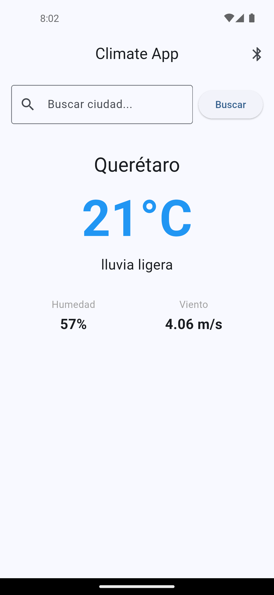
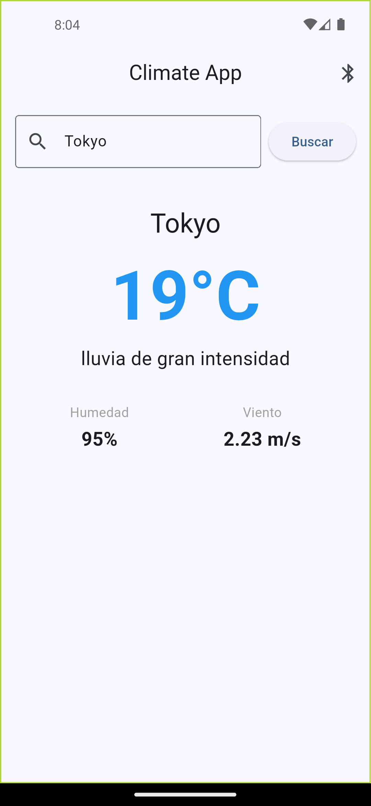
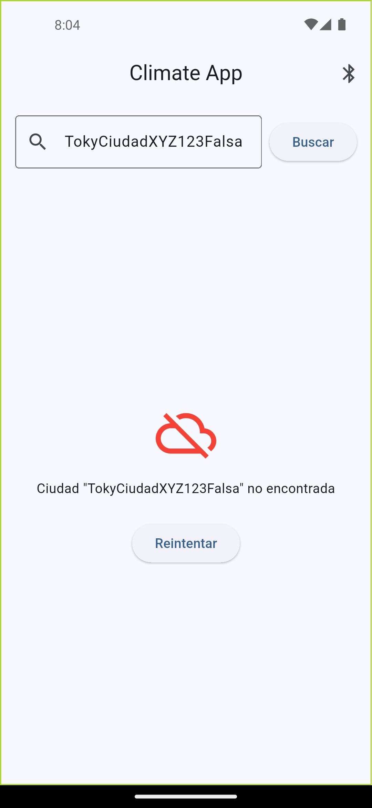
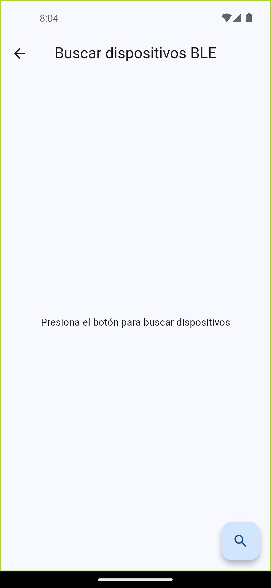

# Práctica P2.5 – Integración API OpenWeatherMap y APK con Firma Digital

Conexión de la app Flutter con la API REST de OpenWeatherMap para mostrar datos climáticos reales, gestión segura de credenciales con variables de entorno, y generación de un APK firmado listo para instalar en dispositivo Android.

## Cómo ejecutar

```bash
cd practicas/p2.5/climate_app
flutter pub get
flutter run
```


## Configuración de variables de entorno

1. Crea el archivo `climate_app/.env` con tu API key:
```
OPENWEATHER_API_KEY=tu_api_key_real_aqui
OPENWEATHER_BASE_URL=https://api.openweathermap.org/data/2.5/weather
```

2. Obtén tu API key gratuita en: https://openweathermap.org/api

3. La API key puede tardar entre 10 y 60 minutos en activarse tras el registro.

## Entregables incluidos

- `lib/config/app_config.dart` – Lee variables de entorno con flutter_dotenv.
- `lib/models/weather.dart` – Modelo actualizado con deserialización JSON segura (description, windSpeed).
- `lib/services/weather_service.dart` – Llamadas HTTP reales a OpenWeatherMap con manejo de todos los errores.
- `lib/providers/weather_provider.dart` – Provider simplificado con fetchWeather().
- `lib/providers/ble_provider.dart` – BLE separado en su propio provider (herencia P2.4).
- `lib/main.dart` – Carga .env antes de runApp, MultiProvider.
- `lib/screens/home_screen.dart` – Barra de búsqueda y datos reales de la API.
- `.gitignore` actualizado: `.env`, `*.jks` nunca se suben al repositorio.
- `android/app/build.gradle.kts` – Signing config para APK release.

## Generación de APK firmado

```bash
# 1. Crear keystore (solo la primera vez)
cd android/app
keytool -genkey -v -keystore climate_app.jks -keyalg RSA -keysize 2048 -validity 10000 -alias climate_key

# 2. Generar APK release
cd ../..
flutter clean
flutter pub get
flutter build apk --release
```

El APK se genera en: `build/app/outputs/flutter-apk/app-release.apk`

## Conclusión

En esta práctica conecté la aplicación Flutter con una API REST real usando el paquete `http`. Aprendí la importancia de no hardcodear credenciales en el código, usando `flutter_dotenv` para cargar la API key desde un archivo `.env` que nunca se sube al repositorio.

También entendí el proceso de firma digital de APKs: sin un keystore válido, Android no instala la app en modo release. La firma garantiza que el APK no fue modificado y que proviene de un desarrollador confiable.

Por otro lado, el manejo de errores HTTP fue clave para que la app no crashee cuando hay falta de conexión, ciudad inválida o problemas con la API key. En general, esta práctica me mostró cómo una app Flutter pasa de usar datos simulados a datos reales del mundo.

## Pruebas

### Pantalla principal – datos reales de Querétaro



> API de OpenWeatherMap respondiendo con datos en tiempo real: 21 °C, lluvia ligera, humedad 57 %, viento 4.06 m/s.

---

### Búsqueda de otra ciudad – Tokyo



> La barra de búsqueda funciona correctamente. Tokyo: 19 °C, lluvia de gran intensidad, humedad 95 %, viento 2.23 m/s.

---

### Manejo de error – ciudad no encontrada (404)



> El `WeatherService` intercepta el código 404 y muestra el mensaje de error con icono y botón "Reintentar", sin crashear la app.

---

### Pantalla BLE (herencia P2.4)



> La capa BLE de P2.4 se mantiene integrada. El ícono Bluetooth en el AppBar abre la pantalla de escaneo de dispositivos.

### Pantalla BLE – dispositivos encontrados (herencia P2.4)


> La capa BLE de P2.4 se mantiene integrada cuando la pantalla encuentra dispositivos
