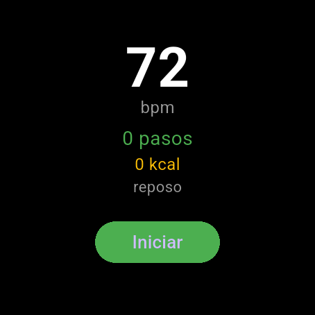
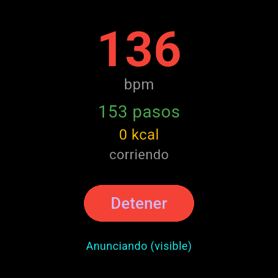
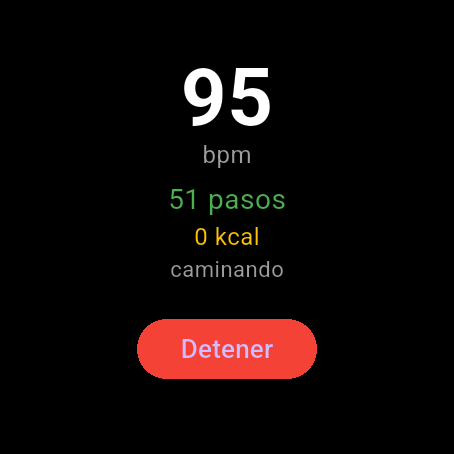
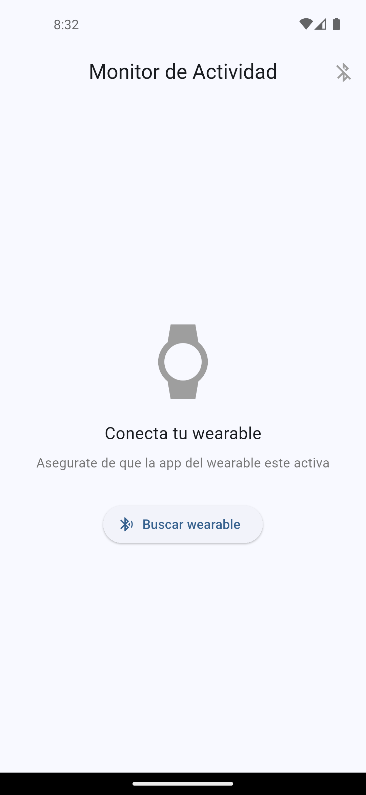
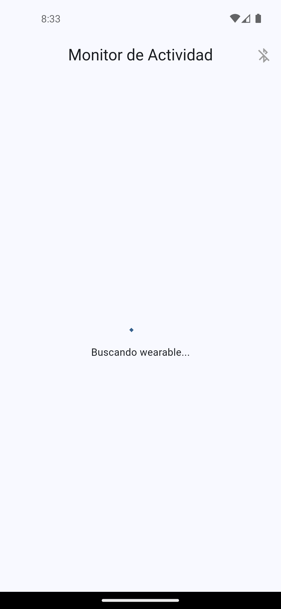
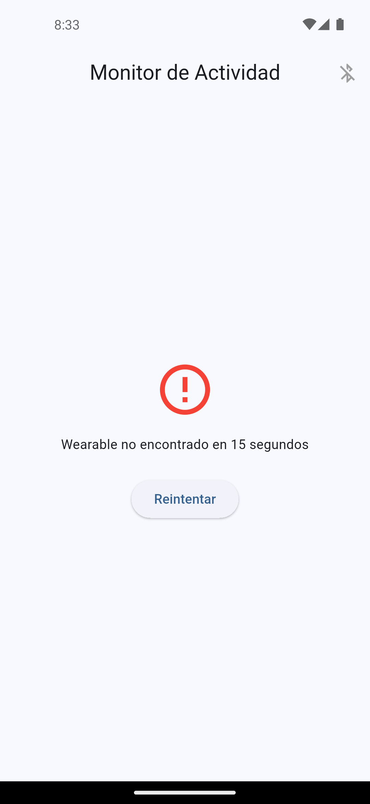
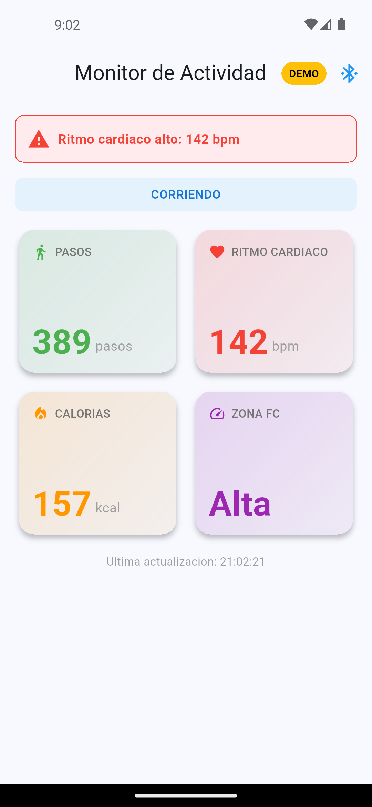

# P2.6 — Monitor de Actividad Física Wearable (Wear OS → Teléfono)

**Unidad 2 — Flutter + Wear OS | 100 pts**

Sistema de monitoreo de actividad física con dos apps Flutter:
- **wearable_app**: corre en Wear OS, simula sensores (pasos, bpm, calorías, estado) y envía datos vía BLE NOTIFY
- **telefono_app**: corre en el teléfono, escanea y se conecta al wearable, muestra dashboard en tiempo real

---

## Flujo de datos

```
[SensorSimulator] → [BleServer NOTIFY] → BLE → [BleClient] → [ActivityProvider] → [MonitorScreen]
     Wearable                                              Teléfono
```

| Origen | Dato | Destino | Transporte |
|---|---|---|---|
| Wearable | Pasos acumulados | Teléfono | BLE NOTIFY (int32 LE) |
| Wearable | Ritmo cardiaco (bpm) | Teléfono | BLE NOTIFY (uint8) |
| Wearable | Calorías quemadas | Teléfono | BLE NOTIFY (int16 LE) |
| Wearable | Estado actividad | Teléfono | BLE NOTIFY (UTF-8 string) |

---

## Estructura del proyecto

```
practicas/p2.6/
├── P2.6_Contexto.md          # Instrucciones completas de la práctica
├── IA.md                     # Uso de IA en el desarrollo
├── README.md                 # Este archivo
├── .gitignore                # Protege secrets, build, keystore
├── captures/                 # Capturas de pantalla
│   ├── wear_idle.png         # Wearable en reposo (72 bpm, 0 pasos)
│   ├── wear_active.png       # Wearable recién iniciado (botón Detener)
│   ├── wear_data.png         # Wearable caminando (95 bpm, 51 pasos)
│   ├── phone_disconnected.png # Teléfono — pantalla inicial
│   ├── phone_scanning.png    # Teléfono escaneando ("Buscando wearable...")
│   ├── phone_error.png       # Teléfono — wearable no encontrado tras 15s
│   ├── phone_dashboard.png   # Dashboard 4 métricas en Modo Demo (caminando)
│   └── phone_alert.png       # Dashboard con alerta bpm > 120 (corriendo)
├── wearable_app/             # App Wear OS
│   └── lib/
│       ├── ble_constants.dart     # UUIDs de servicio y características
│       ├── sensor_simulator.dart  # Simulador de pasos, bpm, calorías, estado
│       ├── ble_server.dart        # Servidor BLE con NOTIFY
│       └── main.dart              # Pantalla circular del wearable
└── telefono_app/             # App Teléfono
    └── lib/
        ├── ble_constants.dart          # UUIDs idénticos al wearable
        ├── models/activity_data.dart   # Modelo con zonas de frecuencia cardiaca
        ├── services/ble_client.dart    # Cliente BLE (scan + NOTIFY)
        ├── providers/activity_provider.dart  # Estado con Provider
        ├── widgets/metric_card.dart    # Tarjeta reutilizable con gradiente
        ├── screens/monitor_screen.dart # Dashboard 2x2 + alerta bpm
        └── main.dart                   # Entry point con ChangeNotifierProvider
```

---

## Requisitos

- Flutter SDK ^3.12.0
- Android Studio con emuladores:
  - **Wear OS Large Round** (API 33+) — para el wearable
  - **Pixel 5 API 33** (o superior) — para el teléfono
- Dependencias: `flutter_blue_plus`, `provider`

---

## Ejecución

### 1. Iniciar emuladores

En Android Studio → Device Manager, iniciar:
1. Wear OS Large Round
2. Pixel 5 API 33

Verificar:
```bash
flutter devices
# Deben aparecer ambos emuladores
```

### 2. Compilar y correr el wearable

```bash
cd practicas/p2.6/wearable_app
flutter pub get
flutter run -d emulator-5556
```

Presionar **INICIAR** en la pantalla del wearable para activar los sensores.

### 3. Compilar y correr el teléfono

```bash
cd practicas/p2.6/telefono_app
flutter pub get
flutter run -d emulator-5554
```

Presionar **BUSCAR WEARABLE** para escanear y conectar.

---

## Capturas

### Wearable — Estado inicial (reposo)



El wearable muestra **72 bpm** en reposo, 0 pasos, 0 kcal, estado "reposo" y botón verde **Iniciar**. Tema oscuro adaptado a la pantalla circular.

### Wearable — Recién iniciado



Tras presionar **Iniciar**, el simulador comienza a generar datos cada segundo. El botón cambia a **Detener** (rojo). El bpm empieza a fluctuar (78 bpm). Los pasos aún están en 0 porque el estado inicial es "reposo".

### Wearable — Datos en actividad (caminando)



Tras ~90 segundos, el simulador cambió aleatoriamente a estado **caminando**: ahora hay **95 bpm**, **51 pasos** y el estado muestra "caminando". El simulador agrega pasos en cada tick y el bpm sube hacia ~95 (objetivo de caminando).

### Teléfono — Pantalla inicial (desconectado)



Pantalla inicial del teléfono con icono de reloj, mensaje **"Conecta tu wearable"** y botón **Buscar wearable**. AppBar con el icono Bluetooth desactivado.

### Teléfono — Escaneando



Al presionar **Buscar wearable**, aparece el spinner con "Buscando wearable..." mientras `BleClient.scanAndConnect()` escanea por `serviceUUID`.

### Teléfono — Wearable no encontrado



Tras 15 segundos de timeout, aparece el ícono de error rojo con el mensaje **"Wearable no encontrado en 15 segundos"** y botón **Reintentar**. Esto demuestra el manejo correcto de errores en `ActivityProvider`.

### Teléfono — Dashboard en Modo Demo


Para demostrar el **Widget de Monitoreo** sin depender del handshake BLE entre emuladores, la app incluye un **Modo Demo** que genera datos simulados localmente. Se observa el badge **DEMO** amarillo en el AppBar, el estado **CAMINANDO**, y las 4 tarjetas (`MetricCard`) con gradientes mostrando: **13 pasos**, **94 bpm**, **5 kcal** y zona FC **Moderada**. Los datos se actualizan cada segundo vía `ActivityProvider` + `Consumer`.

### Teléfono — Alerta de ritmo cardiaco alto



Al pasar a estado **CORRIENDO** (bpm > 120), aparece el **banner rojo de alerta** con `Icons.warning`: *"Ritmo cardiaco alto: 142 bpm"*. La tarjeta de Ritmo Cardiaco cambia de color y la zona FC pasa a **Alta**. Esto cumple el criterio 4 de la práctica (alerta visual cuando `d.heartRate > 120`).

> **Nota sobre BLE en emuladores**: El advertising BLE entre dos AVDs Android no está completamente soportado por la plataforma. El wearable corre el simulador y emite NOTIFY internos (visibles en los logs `[BleServer] NOTIFY ...`), pero el escaneo del teléfono no lo encuentra. Por eso se incluye el **Modo Demo** que reutiliza la misma UI (`MonitorScreen`, `MetricCard`, `ActivityData`, `ActivityProvider`) y demuestra que toda la lógica de presentación funciona. Para verificar el flujo BLE completo en tiempo real, se recomienda usar **dispositivos físicos** con Bluetooth LE real.

---

## Características implementadas

- [x] App Wear OS con simulador de sensores (pasos, bpm, calorías, estado)
- [x] Servidor BLE con 4 características NOTIFY (UUIDs personalizados)
- [x] Pantalla circular del wearable con tema oscuro
- [x] App teléfono con escaneo BLE automático por serviceUUID
- [x] Cliente BLE con suscripción a notificaciones
- [x] ActivityProvider con ChangeNotifier para estado
- [x] Dashboard 2x2 con MetricCard (pasos, bpm, calorías, zona FC)
- [x] Alerta visual roja cuando bpm > 120
- [x] Banner de estado de actividad (reposo/caminando/corriendo)
- [x] Timestamp de última actualización
- [x] Desconexión limpia con cancelación de suscripciones
- [x] Permisos BLE configurados en ambos AndroidManifest.xml
- [x] .gitignore protegiendo secrets y archivos sensibles

---

## Diferencia con P2.4 y P2.5

| Aspecto | P2.4 | P2.5 | P2.6 |
|---|---|---|---|
| Dirección BLE | Teléfono → Wearable | Teléfono → Wearable | **Wearable → Teléfono** |
| Operación BLE | WRITE | WRITE + READ | **NOTIFY** |
| Datos | Temperatura API | Temperatura + pronóstico | **Pasos, bpm, calorías, estado** |
| UI Teléfono | Lista dispositivos | Weather + forecast | **Dashboard 2x2 + alertas** |
| Provider | WeatherProvider | WeatherProvider + BLEProvider | **ActivityProvider** |

---

## Seriación

- **P2.4**: Se reutiliza `flutter_blue_plus` y el patrón de escaneo/conexión BLE
- **P2.5**: Se reutiliza `provider` para estado, permisos BLE en AndroidManifest, y el patrón Service → Provider → Screen
