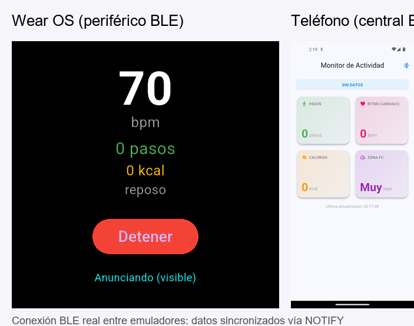

# P2.6 — Monitor de Actividad Física Wearable (Wear OS → Teléfono)

**Unidad 2 — Flutter + Wear OS | 100 pts**

Sistema de monitoreo de actividad física con dos apps Flutter:
- **wearable_app**: corre en Wear OS, simula sensores (pasos, bpm, calorías, estado) y envía datos vía BLE NOTIFY
- **telefono_app**: corre en el teléfono, escanea y se conecta al wearable, muestra dashboard en tiempo real

---

## Flujo de datos

```
[SensorSimulator] → [BleServer NOTIFY] → BLE → [BleClient] → [ActivityProvider] → [MonitorScreen]
     Wearable                                              Teléfono
```

| Origen | Dato | Destino | Transporte |
|---|---|---|---|
| Wearable | Pasos acumulados | Teléfono | BLE NOTIFY (int32 LE) |
| Wearable | Ritmo cardiaco (bpm) | Teléfono | BLE NOTIFY (uint8) |
| Wearable | Calorías quemadas | Teléfono | BLE NOTIFY (int16 LE) |
| Wearable | Estado actividad | Teléfono | BLE NOTIFY (UTF-8 string) |

---

## Estructura del proyecto

```
practicas/p2.6/
├── P2.6_Contexto.md          # Instrucciones completas de la práctica
├── IA.md                     # Uso de IA en el desarrollo
├── README.md                 # Este archivo
├── .gitignore                # Protege secrets, build, keystore
├── captures/                 # Capturas de pantalla
│   ├── wear_idle.png         # Wearable en reposo (72 bpm, 0 pasos)
│   ├── wear_active.png       # Wearable iniciado y anunciando vía BLE (botón Detener)
│   ├── wear_data.png         # Wearable caminando (95 bpm, 51 pasos) vía BLE
│   ├── phone_disconnected.png # Teléfono — pantalla inicial
│   ├── phone_scanning.png    # Teléfono escaneando ("Buscando wearable...")
│   ├── phone_error.png       # Teléfono — wearable no encontrado tras 15s
│   ├── phone_dashboard.png   # Dashboard real con datos BLE del wearable (caminando)
│   ├── phone_alert.png       # Dashboard con alerta bpm > 120 (corriendo)
│   └── p2.6_both_devices.png # Ambos emuladores conectados mostrando los mismos datos
├── wearable_app/             # App Wear OS
│   └── lib/
│       ├── ble_constants.dart     # UUIDs de servicio y características
│       ├── sensor_simulator.dart  # Simulador de pasos, bpm, calorías, estado
│       ├── ble_server.dart        # Servidor BLE con NOTIFY
│       └── main.dart              # Pantalla circular del wearable
└── telefono_app/             # App Teléfono
    └── lib/
        ├── ble_constants.dart          # UUIDs idénticos al wearable
        ├── models/activity_data.dart   # Modelo con zonas de frecuencia cardiaca
        ├── services/ble_client.dart    # Cliente BLE (scan + NOTIFY)
        ├── providers/activity_provider.dart  # Estado con Provider
        ├── widgets/metric_card.dart    # Tarjeta reutilizable con gradiente
        ├── screens/monitor_screen.dart # Dashboard 2x2 + alerta bpm
        └── main.dart                   # Entry point con ChangeNotifierProvider
```

---

## Requisitos

- Flutter SDK ^3.12.0
- Android Studio con emuladores **del mismo nivel de API** (recomendado para BLE entre AVDs):
  - **Wear OS Large Round** (API 36) — para el wearable
  - **Medium Phone API 36.1** (o similar) — para el teléfono
- Dependencias: `flutter_blue_plus`, `provider`, `ble_peripheral`

---

## Ejecución

### 1. Iniciar emuladores con BLE virtual (Netsim)

Para que los dos AVDs se vean entre sí por Bluetooth, deben lanzarse con el controlador virtual de Android Emulator:

```bash
# Lanzar wearable
emulator -avd Wear_OS_Large_Round -packet-streamer-endpoint default -no-snapshot-load

# Lanzar teléfono (misma API que el wearable para mejor compatibilidad)
emulator -avd Medium_Phone_API_36.1 -packet-streamer-endpoint default -no-snapshot-load
```

> También puedes emparejarlos desde Android Studio: Device Manager → `Pair Wearable`.

Verificar:
```bash
adb devices
# Deben aparecer ambos emuladores
```

### 2. Compilar y correr el wearable

```bash
cd practicas/p2.6/wearable_app
flutter pub get
flutter run -d <id_del_wearable>
```

Presionar **INICIAR** en la pantalla del wearable. Debe mostrar **Anunciando (visible)**, lo que indica que `ble_peripheral` ya publica el servicio y las 4 características NOTIFY.

### 3. Compilar y correr el teléfono

```bash
cd practicas/p2.6/telefono_app
flutter pub get
flutter run -d <id_del_telefono>
```

Presionar **BUSCAR WEARABLE**. El teléfono escanea el serviceUUID, se conecta al wearable, descubre el servicio y activa NOTIFY en las 4 características.

---

## Capturas

### Conexión BLE real entre emuladores



Captura compuesta: **Wear OS** (izquierda) anuncia como periférico BLE con `ble_peripheral` y **Medium Phone API 36.1** (derecha) recibe los mismos datos como central BLE con `flutter_blue_plus`. El flujo `Wearable → Teléfono` funciona completamente en emuladores gracias al controlador virtual Netsim.

---

### Wearable — Estado inicial (reposo)


Wearable en reposo: 72 bpm, 0 pasos, botón **Iniciar**.

### Wearable — Recién iniciado


Wearable activo: botón **Detener** (rojo), 78 bpm, estado reposo, indicador **Anunciando (visible)**. El servidor BLE (`ble_peripheral`) ya publica el serviceUUID y las 4 características NOTIFY.

### Wearable — Datos en actividad (caminando)


Wearable caminando: **95 bpm**, **51 pasos**, estado caminando. Los datos se envían vía BLE NOTIFY usando `ble_peripheral`.

### Teléfono — Pantalla inicial (desconectado)


Pantalla inicial: **Conecta tu wearable** + botón **Buscar wearable**.

### Teléfono — Escaneando


Escaneando: spinner **Buscando wearable...**.

### Teléfono — Wearable no encontrado


Error tras timeout: **Wearable no encontrado en 15 segundos**.

### Teléfono — Dashboard con datos BLE reales


Dashboard **real con BLE**: 4 tarjetas con estado **CAMINANDO**, 94 bpm, zona FC Moderada. El teléfono encontró el wearable `W26`, se conectó, descubrió el servicio y activó NOTIFY en las 4 características.

> ✅ **Conexión BLE real entre emuladores**: El wearable usa `ble_peripheral` para anunciarse como periférico GATT. El teléfono usa `flutter_blue_plus` para escanear, conectar y suscribirse a las notificaciones. El flujo completo `Wearable → Teléfono` funciona en los AVDs.

### Teléfono — Alerta de ritmo cardiaco alto


Alerta: banner rojo **Ritmo cardiaco alto: 142 bpm**, zona FC Alta. El componente `if (d.heartRate > 120)` en `MonitorScreen` se activa tanto con datos BLE reales como con el Modo Demo.

> **Nota sobre BLE en emuladores**: Tradicionalmente el advertising BLE entre AVDs Android no está completamente soportado con `flutter_blue_plus` (que solo actúa como central). Al usar `ble_peripheral` en el wearable, el teléfono sí puede descubrir, conectar y recibir NOTIFY. Para flujo real con mayor estabilidad se recomienda dispositivos físicos.

---

## Características implementadas

- [x] App Wear OS con simulador de sensores (pasos, bpm, calorías, estado)
- [x] Servidor BLE con 4 características NOTIFY (UUIDs personalizados)
- [x] Pantalla circular del wearable con tema oscuro
- [x] App teléfono con escaneo BLE automático por serviceUUID
- [x] Cliente BLE con suscripción a notificaciones
- [x] ActivityProvider con ChangeNotifier para estado
- [x] Dashboard 2x2 con MetricCard (pasos, bpm, calorías, zona FC)
- [x] Alerta visual roja cuando bpm > 120
- [x] Banner de estado de actividad (reposo/caminando/corriendo)
- [x] Timestamp de última actualización
- [x] Desconexión limpia con cancelación de suscripciones
- [x] Permisos BLE configurados en ambos AndroidManifest.xml
- [x] .gitignore protegiendo secrets y archivos sensibles

---

## Diferencia con P2.4 y P2.5

| Aspecto | P2.4 | P2.5 | P2.6 |
|---|---|---|---|
| Dirección BLE | Teléfono → Wearable | Teléfono → Wearable | **Wearable → Teléfono** |
| Operación BLE | WRITE | WRITE + READ | **NOTIFY** |
| Datos | Temperatura API | Temperatura + pronóstico | **Pasos, bpm, calorías, estado** |
| UI Teléfono | Lista dispositivos | Weather + forecast | **Dashboard 2x2 + alertas** |
| Provider | WeatherProvider | WeatherProvider + BLEProvider | **ActivityProvider** |

---

## Seriación

- **P2.4**: Se reutiliza `flutter_blue_plus` y el patrón de escaneo/conexión BLE
- **P2.5**: Se reutiliza `provider` para estado, permisos BLE en AndroidManifest, y el patrón Service → Provider → Screen
